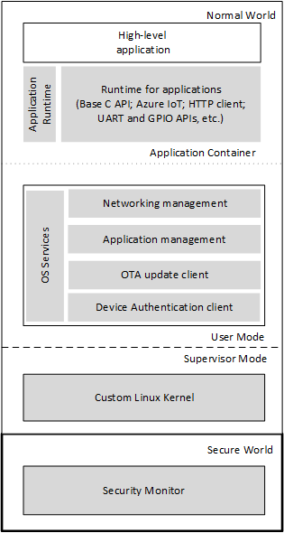
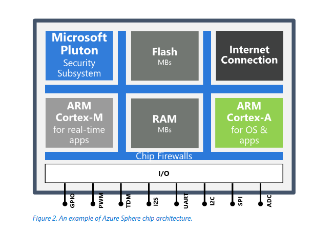
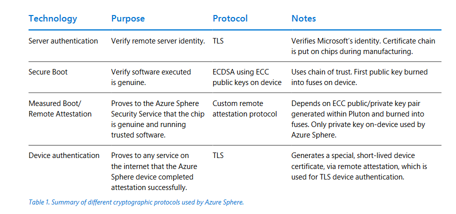

# IoT Security in Best Practice: Azure Sphere

## Problem

Dealing with securities of Microcontrollers (MCUs) which are low-cost, single chip computers. There are 9 billion new MCU devices built and deployed every year! MCUs should server to improve the customer experience with a product (like in terms of convenience) and be self-reliant once they are deployed (needing no future debugging from users or minimal maintenance work). Maintenance work cost a lot of money for the companies!

In addition, ensuring security for these devices is important, especially for ones connected to the Internet - which ideally, will be all of them since cloud computing is very useful.

## Product

Azure Sphere has four important parts:
- Certified chips: Chips built-in with Microsoft Pluton hardware **root of trust**
  - The Pluton security subsystem is the hardware-based secured root of trust for Azure Sphere. It includes security processor core, cryptographic engines, hardware random number generator, pub/private key generation, asymmetric and symmetric encryption, and measured boot in silicon to support remote attestation with cloud service.
- OS: Multi-layered, defense-in-depth operating system with robust application isolation
  - OS services host the high-level application container and are responsible for communicating with the Azure Sphere Security Service. It manages network authentication and the network firewall for outbound traffic
  - The OS runs all its applications in User Mode / **Normal Mode (NW)**
- Custom Linux Kernel + Security Monitor:
  - Below the OS sits a custom linux kernel which runs code in Supervisor Mode, and below that is the **Security Monitor** which runs in **Secure World (SW)** mode.
  - Security Monitor is supplied by Microsoft, and it is responsible for protecting security-sensitive hardware such as memory, flash and other shared MCU resources and for safely exposing limited access to these resources. The Security Monitor brokers and gates access to the Pluton Security Subsystem and the hardware root of trust and acts as a watchdog for the NW environment. It starts the boot loader, exposes runtime services to NW, and manages hardware firewalls and other silicon components that are not accessible to NW.
- **Security Service**: Service running in the cloud which guards every Azure Sphere device through brokering trust, detect emerging threats, and renews device security
  - The Security Service provides three main features: passwordless authentication, remote update, and per-device error reporting.

## Practices

Microsoft lists out seven properties of highly secured devices, which the Azure Sphere abides with:

1. Hardware based root of trust
   1. Every Azure Sphere MCU is identified by an un-forgeable cryptographic key that is generated and protected by Microsoft-designed Pluton security subsystem hardware
2. Defense in depth
   1. Provides multiple layers of security and thus multiple mitigations against each threat. Each layer of software in the Azure Sphere platform verifies that the layer above it is secured.
3. Small trusted computing based
   1. Only the secured Security Monitor, Pluton runtime, and Pluton subsystem run on the trusted computing base.
4. Dynamic compartments
   1. Azure Sphere MCUs contain silicon counter-measures, including hardware firewalls, to prevent a security breach in one component from propagating to other components. A constrained, "sandboxed" runtime environment prevents applications from corrupting secured code or data.
5. Password-less authentication
   1. The Azure Sphere platform requires every software element to be signed. Device-to-cloud and cloud-to-device communications require further authentication, which is achieved with certificates.
6. Error reporting
   1. Azure Sphere devices can automatically report operational data and errors to a cloud-based analysis system, and updates and servicing can be performed remotely.
7. Renewable security
   1.  The Azure Sphere Security Service updates the Azure Sphere OS and your applications automatically.

## Proof