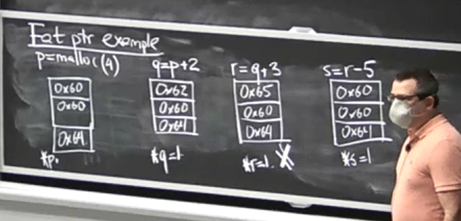

## Day 4 - Buffer Overflow Defenses

We're living in a world with a lot of error-prone C code. How could we go about making them less exploitable? Some options include:

- Rewriting in a more memory safe language like Rust, Go, ...
  - However, this effort is time-consuming and it's possible the new program doesn't work as expected
- Finding and fixing bugs
  - There are known techniques for finding buffer overflows in code
- Make them more difficult to exploit
  - This is the idea that the Baggy Bounds paper try to implement. We're essentially trying to put in protections that makes the code harder to exploit during runtime

## What is our threat model? Typical attack?

1. Overflow buffer(s)
2. Jump to program counter from adversary
3. Run adversary's code
  
## Common defenses:

* Non-executable stack (NX)
  * Focused on third step (running adversary coe)
  * In our application & address space, we designate areas that are either writable or executable, but not both. One application of that is to explicitly denying executing code from the stack.
  * This is a useful technique since generally all code that you need to run is loaded at the start and is static, though this is not true for some applications like browsers (JIT compilers)
  * Aside: **Virtual memory** wasn't initially intended as a security measure, though it does now offer a write/executable bit.
* **Stack canaries**
  * Focused on second step (jumping to program counter)
  * The idea of a canary is to put a canary at various places in the program, most often after a buffer, with specified/randomized values. When the function is just about to pop the return pointer, it will check the canaries and verify that their values did not change.
  * Canaries are inserted codes (*instrumentations*) done by the compiler to add the canaries and to check them for corruption
  * Canaries don't really prevent the buffer overflow from happening but it tries to prevent the overflow attack from doing more damage outside of the function
  * **Cons**: Canaries can still be get around if the attacker has a way to detect and view the canary values. There's also potential issues arised from canaries sharing (e.g. in cases of forked processes, which need to have the same canaries as its parents otherwise it won't be able to return correctly)
* Address space layout randomization (ASLR)
  * Changes the virtual address where the stack is stored on each runtime. Makes it harder for attackers to set static addresses to return to since they can't easily predict where their injected code is located 
  * **Cons:** ASLR may be exploitable if system doesn't have good randomness or doesn't randomize stack layout often enough (maybe only every restart instead of every new process). Additionally, we need some overhead like storing flags to allow programs to live in any address space, since you can't depend on a static address but rather need a lookup table to find where the program lives
    * Also one interesting attack that could be put on programs that do dynamic code generation like browsers is to send it tons of requests, which will end up filling the memory space. In that regards, it won't matter where you jump in memory since you are going to end up in some program instance anyways.

## Heap overflow

These are the types of attack that the Baggy Bounds paper is concerned with. With dynamically allocated objects they are given a space on the heap to work with. For example, if you ask for 16 bytes to be allocated on the heap using malloc, you will be given back a pointer that points to the start of that object.

Also, the system stores metadata with each allocated object, usually as 2 points, "next" and "prev" located just before the data section. These two pointer types are used to make a doubly-linked list to keep track of all allocated chunks in the system, and also to make it easier to reclaim chunks when freed().

What happens when you overflow a pointer on the heap?

- You will likely be overwriting the next and prev pointer of the next heap region. This may allow you to get arbitary code access
  - For example, say, another malloc() call occurs after you overflowed the next heap object. Say malloc() decides to look into the region with the corrupted pointers and removes it from the free-chunk list. It will also set:
    -` b.next.prev <- b # Next guy points back to you`
    -` b.prev.next <- b # Previous guy points up to you`
    - where b is the address of the region, which the attacker also has access to
  - Since the attacker has control over `b`,`b.next`, and `b.prev`, the attacker in effect has arbitary write to two regions of memory.

Heap overflows are much common than stack overflow these days, since stack has more readily defenses and checks done by the compiler nowadays.

## Bounds checking

Idea: **Fat pointers**
 - Implemented at the compiler level. Some machines even have hardware support for fat pointers.
 - Instead of having a pointer by itself, we want to add additional information and padding to it, e.g. 
   - p (pointer itself)
   - base 
   - limit
 - This triplet allows us to perform bound checks for the pointer.
   - Upon malloc(), we set `base=p, limit=p+sz`
   - For deferencing *p, we check `base <= p < limit`
   - For pointer arithmetic (like `q = p+5`), for that new pointer we allow it to set new value, but keep same base and limit. That way, we can prevent it from being deferenced if it goes out of bounds.

Fat pointer example:

Note: Third line will crash since it goes out of bounds and tries to dereference.

**Cons**: Performance will likely take a bit of a hit since the compiler will need to do a lot of checks for every pointer use. You are also making pointers 3x the size. Also some programs will do casting pointers to integers, and we can't really do that here safely without additional configurations. Also nowadays pointers arithmetic are no longer atomic. You'll have to deal with weird cases with child processes, multi-thread applications, and intermediate pointers. There's also concerns with compatibility (ex. libc expecting normal pointers, but you pass in your large pointer format)

### Baggy Bounds

Versions of baggy bounds have been implemented in large programs like Microsoft SQL server, VMs, etc. Many systems have similar designs to this technique since it offers a good protection with relatively little overhead.

For baggy bounds they store a table on the side which keeps track of all the pointer metadata for us (e.g. the base and limit). The idea is for every pointer you can look up their info in the table. At first, you may realize that this table is not be very performant. Baggy bounds try to address this by:
 -  Only allocating objects in power of 2 (256, 512, 1024, etc.) Even though you are potentially allocating more than what the application is looking for, we can now store the size using log_2, which means we only need 5 bits to describe size of all objects.
 -  Also, knowing the size and the current pointer, we know exactly what the base is (since every object is aligned to a multiple of some 2^n size).

Thus, for baggy bounds, *the table is really just a list of one-byte entries.*

We also define a *slot_size*, e.g. the smallest allocation size that we allow in the program. That means that we need a table entry for each 16-bytes in the address space. So for example, a 64-byte object at address x uses 4 table entries starting at table [x/16].

How do we deal with changing a pointer from one valid pointer range to another valid pointer range?
- When a pointer goes out of bounds from its original reference object, we flip the **high bit** on the pointer. On a x32 bit machine the upper half of the address space is actually reserved for the kernel so if you try to access a high address like that directly you'll crash (the system will say the address is not acccesible).
- We still allow the pointer to go back in bounds with pointer arithmetic because we can ignore the MSB and using the address info & known conventions (e.g. assuming pointer didn't go beyond `+/- slot_size/2` bytes) figure out where the original object was. 
  - This is done by saying if the OOP is located in the first half of the slot, then it must have came from previous slot, otherwise, it must have came from the next slot.
  - However, baggy bounds will panic if arithmetic tries to move OOB more than slot_size/2 away.
    - **Self-question:** Is this a good assumption / restriction on programs?
      - Yes, generally no actual good/benevolent usage of pointers will stray beyond one or two bytes beyond the actual object.
  
**Question:** Why supporting these out of bounds pointers at all?
- The issue is that a lot of C programs use OOP (ex. using a pointer that is at one index beyond array to use as a limiter for a for loop). Thus we want to provide compatibility for those programs.
    
~~~text
Given object p, here's how to find size and start of the object
  p points into, for slot_size=16:
  size = 1 << table[p >> 4]; // 4 is the number of bits in 16.
  start = p & ~(size - 1);   // clears the low log2(size) bits.
~~~