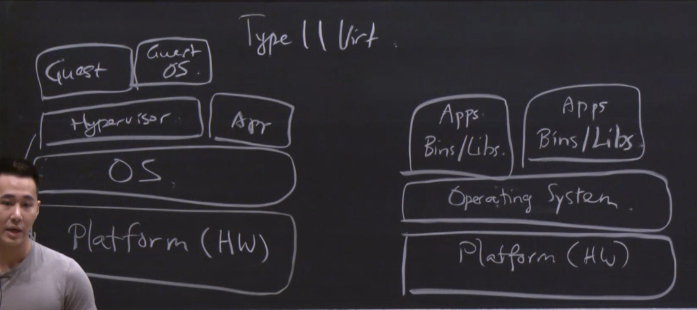
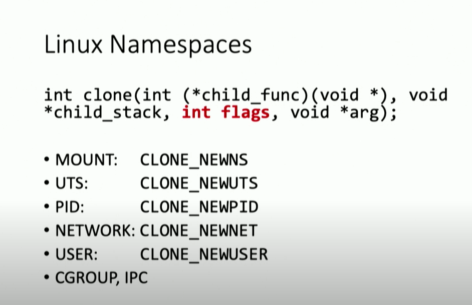
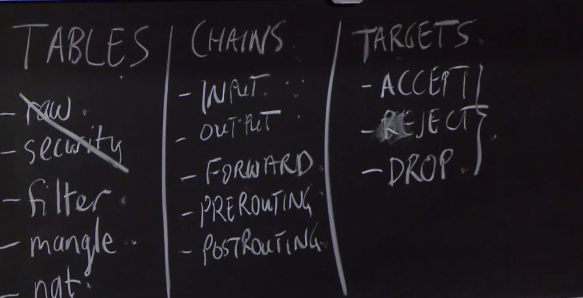
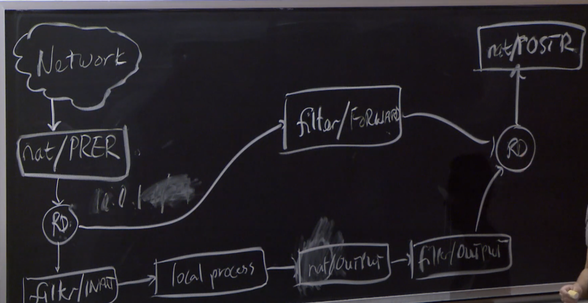

# Linux Containers

## Privilege Separation Concepts

* Least privilege (LP)
  * Only assign the minimal set of privileges the program need to carry out function
* Separation of Duties (SoD)
  * Segregation of functionalities done by an entity so that they can be checked by other components

## Threat Models

Regular apps using httpd and mysql. If the application is compromised the system is likely compromised.

## Current techniques

* chroot (pivot_root)
  * Make the root of the filesystem be located elsewhere in the FS (but application still see as normal)
  * But doesn't work with privileged programs
* VMs
  * Too expensive to run
  * If multiple VMs, increase administrative work to patch and keep up up-to-date
 
## Separation Models

`One CPU many kernels:` Traditional VMs uses a  Type II Hypervisor (lies above the Operating System). Bare metal hypervisors are Type 1. Both of these uses hardware assisted acceleration.

`One kernel many userlands`: For containers, they are a similar image except that we **don't have a hypervisor** in the model. Instead we run containers which itself contains individual applications with its compiled binaries and shared libraries. Thus containers are not hardware assisted and instead depends on a number of function calls at the beginning of application to set it into the custom mode.

## Linux Containers

Like chroot but on steroids. Each container consists of a set of processes. It also uses a number of tools to allow for privilege separation:

* Namespaces
  * Provide a way to isolate different logical groups within the main OS. Isolate kernel elements
  * Is a feature of Linux kernel that partitions resources s.t. one set of processes see a set of resources while another set of processes see a different set of resources.
  * Common namespaces in Unix:
    * PID: Allow for isolation of processes
    * UTS: Allow for setting namespace to have its own FQDN (fully-qualified domain name) and independent network stack (e.g. private routing table, set of IP addresses, firewall, etc.)
    * Network: Allow for isolating networking within the environment
    * Cgroup
    * IPC: Isolate inter process calls
    * User: Allows for isolation between different groups of users. In particular, it allows for a process to have `root` privileges within its user namespace but not have it in another user namespace.
    * Mount
  * Example usage:
    * `child_pid = clone(..., CLONE_NEW_UTS, ...)`
* **cgroups**
  * A kernel supported feature that group functions into slices. For example there is the `user` slice, which consists of applications initiated by the user. The `high-level system` slice is made of high-level system service like NTP (for synching time), cron jobs, etc. There is also a `low-level system` slice made of processes that run within the kernel space
  * Benefits of cgroups:
    * Isolate processes
    * __Limit resource usage__ (you can define fine-grained policies for limiting CPU and resource usage)
      * One of the biggest benefit for using cgroups!
* Capabilities
  * **Enforces namespaces and reduce undesired privileges**
  * Provide as way to divide up root privileges into many different **capabilities** and allow users to assign only the ones you need for a program
  * Individually assigned on a per-file or per-program basis
  * For example `CAP_NET_RAW` allows you to create raw bytes and send to the network interfaces
  * Useful commands: `capsh`, `getcap`, `setcap`.
  * You can see additional flags for each capability:
    * E - Effective = Activated
    * P - Permitted = The application code can request for this capability
    * I - Inherited = Capability can be inherited by child processes
* seccomp-ppf
  * Stands for `secure computing` with Berkley packet filters
  * Limit the calls you can actually invoke from an application
  * For each syscall executed, the kernel goes down the list of allowed syscalls and check if it is there. Otherwise exit with "bad system call"
  * Useful function: `prctl`

The benefits of linux containers are that they are fast, easy to start, and you can achieve most things under them as you would with a VM (like SSH-into it, installing packages, executing commands)

Linux containers get a bridge network interface made by the main OS that they connect to. And within each container it also has its own virtual network interfaces to handle routing and filtering. **Namespaces** allows us to have our own custom **cgroups** within the container.

Overall, HWA Virtualization > Linux Containers > Chroot in terms of total isolation.

## LXC 

Unprivileged containers live within the user home folder (e.g. ~/.local/share/lxc). The top directory of each container has a config file which you can add or remove capabilities among other changes

Commands for working with containers: `lxc-create`,`lxc-start`,`lxc-stop`, `lxc-ls`, `lxc-attach`

### Iptables

Containers get a bridge interface to main OS that they connect to get network access. `Iptables` is used to control and filter packages. Most of the normal configuration we do goes in the `filter` table. Tables consist of chains. As you traverse the chain there are specific targets, e.g. actions, associated at that step.

Targets allow for ACCEPT, DENY, and DROP.

Diagram of how packets are evaluated according to iptable:

Commands: `iptables -t filter -L`, `iptables -A INPUT -s 10.0.69.176 -p tcp --dport 3306 -j ACCEPT`, `iptables -P INPUT DROP`

Note: DROP is a silent reject, while REJECT sends a message back to the user.