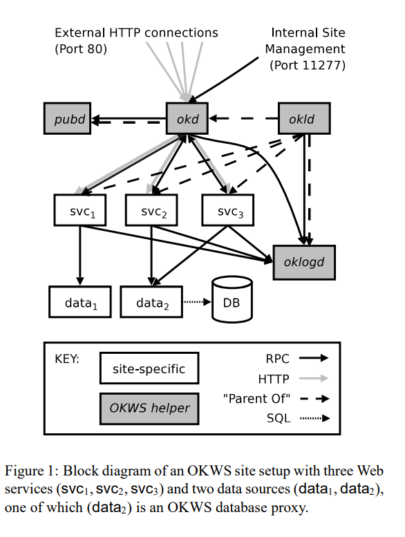

## OKWS

Link: <https://css.csail.mit.edu/6.858/2022/readings/okws.pdf>

## Intro

Most dynamic Web sites today have large server-side databases, to which users have limited access to. Keeping this data hidden and correct is important but difficult to do right. Also, a flaw in one service can often ripple through an entire system.

OKWS is specialized for dynamic content and not suited to serving files from Disk. Instead it relies other exisiting Web servers like Apache to serve images and other static content. This provides a separation from static and dynamic content which adds to the security.

## Security Issues in Current Web servers

* Disclosing of private data
  * Attackers use knowledge about local configuration and custom applications to leak sensitive files
  * This is done through **chroot**, which confines each services to a remote jail directory. For okws, within the jail, each process has just enough access privileges to read shared libraries upon startup and to dump core upon abnormal termination. The services don't have access to file system
* Buffer Overflows
  * Many modules have unchecked boundary conditions that leads to overflow.
* DOS
  * Outside of TCP/IP-based DOS, Apache has also shown tobe vulnerable to application-specific DOS attacks
* Popular modules are insecure
  * For example, in past years the PHP core has had many critical buffer overflow flaws

## Model

Assume cluster of Web servers and database machine connected by fast, firewalled LAN. Site data cached at Web servers and persistently stored on database machine.

## Security guidelines

OS-enforced policy should hide sensitive files from server processes. Server processes should run as unprivileged users with minimal set of database privileges and is separated by the functionality that they serve.

## Design

* okld (launcher daemon)
  * Launches custom services and relaunch them should they crash
  * Ensures that no two services share a UID or GID. It aslso changes the ownership and permissions of service executables at launch if they are not appropriately set.
  * If a service exits uncleanly too many times in a given interval, okld will mark it broken and refuse to restart it.
* okd (dispatcher)
  * Routes incoming requests to appropriate Web services
  * To launch a single service, okld will open 2 socket pairs, one for HTTP forwarding and the other for RPC control messages.
  * Upon receiving a request, okd looks up a Web service corresponding to its abs_path in the dispatch table.
* pubd (helper)
  * Provides services with limited read access to config files and HTML templates files on local disk
  * OKWS imposes structured RPC interface between Web services and the database. It also uses a simple authenticatin mechanism to align partition among database access methods with the partition among processes
  * Is responsible for parsing and caching all required templates upon startup, and that is then shipped over RPC to other processes that require them (thus other processes do not read the file directly).
* oklogd (logger)
  * Write log entries to disk
  * Receives log updates in batches from services and then executes those writes. 
  * A compromised okd or Web service cannot maliciously overwrite or truncate log files. The best thing it can do is to fill them with extra noise.
* Database proxies
  * Uses a simple auth mechanims for authenticating web services.
  * After web service connects to database proxy, it supplies a 20-byte auth token in a login message. This token isused to grant the Web service permission to access a set of RPCs based on the provided token.

As part of the design, OKWS assign on Unix process _per service_ (Note: one Unix process per user is stronger, but not performant). An assumption as part of their threat model is that a process `p_1` is equally vulnerable in the different architectures and that all architectures succeed equally in isolating different processes from each other. Their claime is tht OKWS, through this design, achieves the same isolation properties as Flashbut with a process pool whose size is independent of the number of concurrent HTTP connections.

## Security Benefits

- Little access to filesystem
- Processes are logically separated under different user IDs
- Limited database access
  - An attacker who gains control of an OKWS web service can only interact with the database in a manner specified by the RPC protocol declaration (no generic SQL client access)
- Process isolation
  - Processes that do most of the HTTP parsing have the fewest privileges.