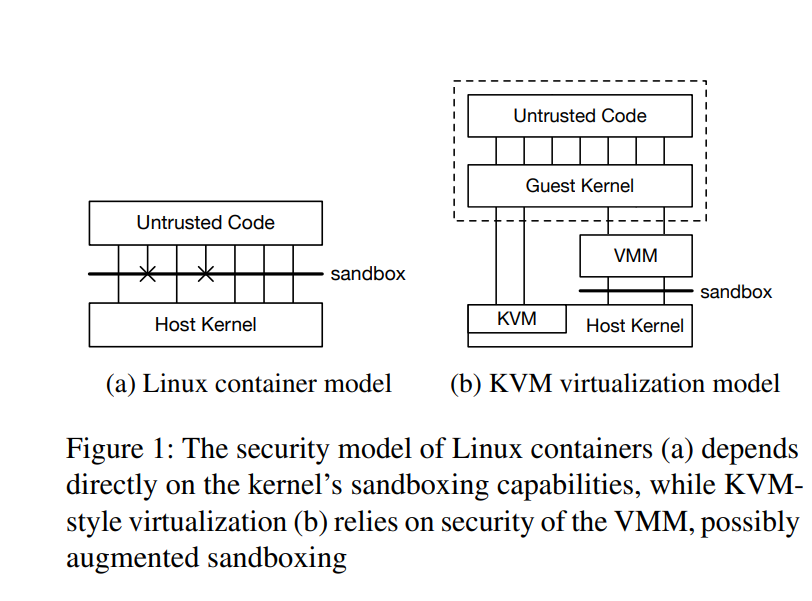
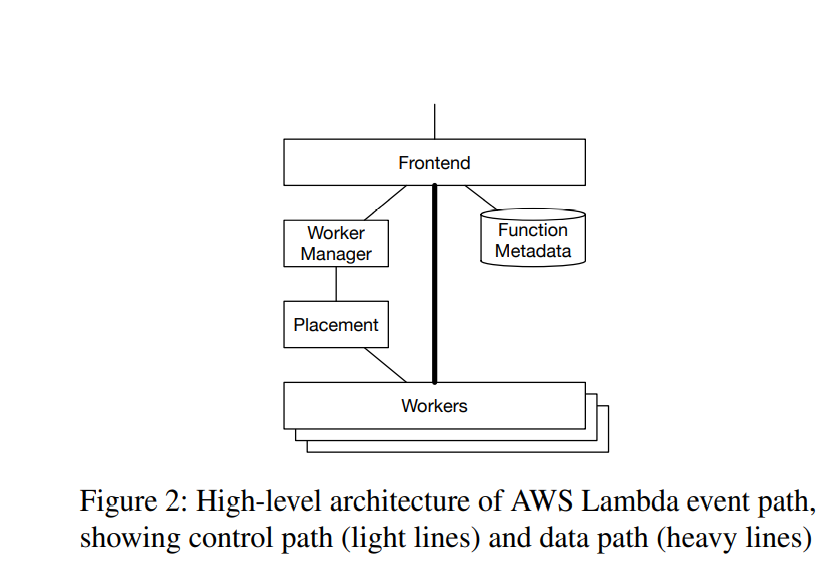

# Firecracker

Link: <https://css.csail.mit.edu/6.858/2022/readings/firecracker.pdf>

**Definition**: Serverless is a cloud development model that abstracts server from the app dev process, allowing app to grow and scale very quickly as needed. 

Serverless containers and functions are widely used for deploying and managing software in the cloud. This is because they allow for lower costs, better utilization of hardware, and fast scaling compared to traditional methods.

For serverless applications to run well, they need workloads from multiple customers run on the same hardware with minimal overhead, while maintaining strong security and isolation.

Firecracker is an **VMM** (Virtual Machine Monitor) specialized for serverless workload.

## Current containers

There are three main options for isolated workloads: containers, virtualization, and language VM virtualization.

Current container methods like Docker and LXC depend on isolation mechanics built into Linux kernel, such as cgroups, namespaces, resource throttling, seccomp-bnf, etc. However, the researchers argue that this method requires for developers to tradeoff between security (limiting syscalls) and code compatibility (software may break).They also feel that QEMU is focused on flexibility and feature completeness rather than overhead, security, or fast setup.

Modern virtualization uses hardware features like Intel VT-x to provide each sandbox with its own virtual hardware, page tables, and OS kernel. The VMM and kernel associated with guest does some computation before useful work limiting density.

## Threat Model / Valued Properties

* Isolation: Safe for multiple functions to run on same hardware without risk of privilege escalation, data leaker, etc.
* Overhead and Density: Must be able to run thousands of functions on a single machine
* Performance: Functions must run near native performance consistently
* Compatibility: Allow functions to have arbitrary Linux binaries and libraries
* Fast switching
* Soft allocation: Must be possible to over commit resources while having each function only consuming the amount that it actually needs.

## Firecracker Model

It does **not** offer: BIOS, arbitary kernels booting, emulating legacy devices or PCI, and VM migration. It also can't boot Windows.

Approach is to use KVM but replace the VMM with a minimal implementation (~50K lines) written in a safe language (Rust). Reducing feature set help reduce surface area for attack and controls the size of the TCB.

The Firecracker process provides a __REST API__ over a Unix socket to allow configuring, managing, and starting and stopping MicroVMs. It also has support for device emulation for disk, networking and serial console, and configurable rate limiting for network, disk throughput, and request rates. Many of these options can be configured using REST API.

## AWS Lambda

AWS Lambda is a compute service that runs functions in response to events. It is used as backends for IoT, mobile, and web applications. At the high level, requests come in at the frontend, which is then authenticated, validated, and then sent to the **Worker Manager**. The Worker Manager is responsible for routing requests to workers that is serving the function, and to request new slots for them if there isn't enough / any. Each worker runs hundreds of thousands of MicroVMs, each providing a single slot.

The MicroVM is the primary security boundary, with all components assuming code running inside MicroVM is untrusted. One Firecracker process is launched per MicroVM, and it has a part called MicroManager that is responsible for slot management and providing an invoke API event to send results to the Frontend.

The MicroManager keeps a small pool of pre-booted MicroMs that are on-hand when Placement requests a new slot. This is to help reduce boot time.

