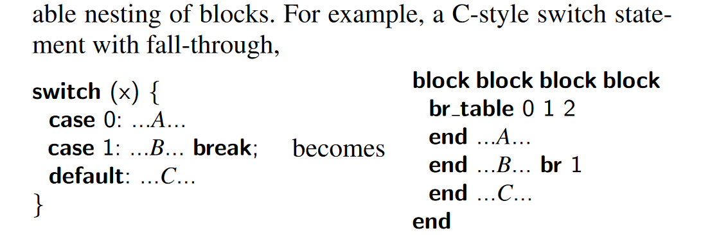

## WebAssembly

WebAssembly offers compact representation, efficient validation and compilation, and low to no-overhead execution. The design of WebAssembly is abstracted over modern hardware, which makes it language and platform-independent.

Javascript is the only natively supported programming language on the web, and over time, it has become a compilation target for other languages. However, JS has a number of pitfalls that makes it an inconsistent and sometimes non-performant compilation target.

## Values + Desired Properties

A low-level compilation target should have:

- Good *semantics*
  - Which are safe and fast to execute, along with being language, hardware, and platform-independent
- Safe and efficient *representation*
  - Which are easy to decode, easy to validate and compile, and are streamable and parallelizable

Overall, these properties meet three main values:
- Safety
  - Some managed languages like the browser's Javascript VM allow enforcing *memory safety*, which prevents program from compromising user data or system state. However, managed languages runtimes do little to protect memory-unsafe C/C++ applications
- Fast
  - We generally prefer native machine code, since they are typically optimized ahead of time.
- Portable
  - The code needs to be able to run anywhere
- Compact
  - Code sent over the network should be as compact as possible to reduce load times and save on bandwidth. For example, JS code is much less compact than a binary format.

## Existing Techniques

Microsoft ActiveX was way to sign x86 binaries on the web, and relied on a trust model rather than technical construction.

Native Client, on the other hand, relied on static validation of x86 machine code, requiring binaries to have certain formatting & safe memory usage patterns. However, it is only supported on Chrome and is platform specific (since it acts as a subset of a particular architectures machine code)

Emscripten converted C/C++ code to JS.

## WebAssembly Design

### Normal Aspects

A binary takes the form of a **module**. Modules defines functions, globals, tables, and memories. A dynamic representation of a *module* is called its **instance**, which has mutable memory and an execution stack. The instantiation operation for modules is provided by the *embedder*, such as a Javascript virtual machine or operating system. 

Code in a module are divided into individual functions, which are not first-class (cannot be nested in each other). Also by construction of WebAssembly the contents of the call stack for execution are not exposed.

Like normally assembly, WebAssembly computation is based on a *stack machine* (code that push or pop things from the stack). Also with typing the layout of the stack can be statically determined at any point in the code. Memory access is done with "load" and "store" instructions. WebAssembly code can also produce a **trap**, which is like an exception that is handled by the embedder. 

For types, WebAssembly has only four basic **types** _t_, which are integers and IEEE 754 floating point numbers.

### Interesting Semantics

Each module can define at most one **memory** chunk, which can be shared with other instances via import/export. Memory has a initial static size but can be dynamically increased with **grow_memory** instruction. We can query for the current memory size.

The semantics of memory access is completely deterministic and portable across all engines and platforms, even for unaligned access and unrestricted type-punning.

**Security**: Emphasis was done on fast **in-process isolation.** The linear memory used by each module is disjoint from the code space, execution stack, and engine's data structure. By this design, at worst, a buggy program can only mess up the data in its own memory. Untrusted modules can be safely executed in the same address as other code. Also all memory accesses in WebAssembly can be guaranteed safe with a single dynamic bounds check.

Additionally, regarding the **control flow**, WebAssembly does not allow simple jumps and instead have *structured control flow* more akin to programming language. Thus it is not possible for programs to contain branches to blocks with misaligned stack heights or branch into the middle of a multi-byte instruction (help prevent ROP gadgets). Branches have "label" immediates that do not reference program positions in instruction stream but rather reference out control constructs by relative nesting depth. While at first this may seem to be a severe limitation on the program, in fact most control constructs from higher-level languages cna be expressed with suitable nesting of blocks.

Example:

Thus by design, unstructured and irreducible control flow using *goto* is impossible in WebAssembly. Producers have the responsibility to transform unstructured & irreducible control flow into structured form (this is already seen in web compiling converting JS to structured control). In addition, Web Assembly allows for direct and indirect calls, though function dynamic signatures are always checked before entering.

**Shortcoming**: WebAssembly does not (yet) have threads - according when the paper was published, and thus no non-determinism from concurrent memory access.

**Execution**: is done relative to a global store *s*. A **store** is a record of the list of module instances, tables, and memories allocated in it.

### Validation

The validation rules for WebAssembly are defined as a type system. It is designed to be simple, meaning it can be efficiently checkable in a single linear pass, interleaved with binary decoding and compilation. Since modules is a closed definition, no context is required for validation. The validator simply checks that each individual definitions are valid and all export names are different.

By virtue of the **type system**, WebAssembly implies the absence of type safety violations like invalid calls or illegal accesses to locals, thus guaranteeing memory safety. It also establishes memory and state *encapsulation* (e.g. creating abstraction properties in the module and function boundaries that disallowing leaking information unless explicitly exported/returned)

### Binary Format

A binary represents a single module and is divided into sections according the different kinds of entities declared in it. Code for functions are deferred to a separate section put after all declaration, which allows a browser engine to minimize page load latency by starting streaming compilation as soon as function bodies are received over the wire.

WebAssembly gives the choice of deciding how programs are loaded into the execution engine and performing I/O to the **embedder**, which makes like a virtual ISA and allow for different platform to decide how to embed a WebAssembly implementation into their execution environment.

In additional, developers can define common ABIs on top of WebAssembly so that modules can operate in heterogenous applications, which helps makes Webassembly more universal as a code format.