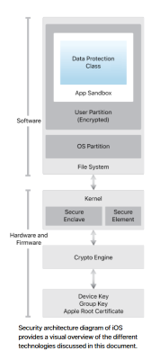
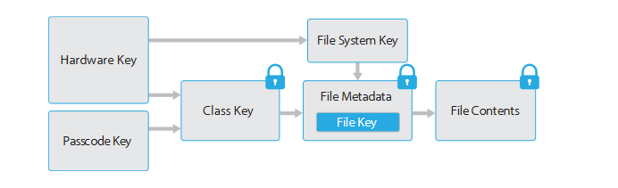

# iOS Security - May 2019 Paper

Link: <https://css.csail.mit.edu/6.858/2022/readings/ios-security-may19.pdf>

Apple drew on known security issues in the desktop environment and sought to incorporate innovative features to tighten mobile security and protect the entire system by default.

## System Security

System security is designed so that both software and hardware are secure across all core components of every iOS device, from boot-up process to software updates to Secure Enclave. The secure boot chain, code signing, and runtime process security all help to ensure that only trusted code and apps can run on a device.

### Secure Boot chain

Each step of the startup process only use components that are cryptographically signed by Apply to ensure integrity, and it only proceeds after verifying the chain of trust:

1. When an iOS device turns on, its processor executes code from read-only memory called **Boot ROM**. The Boot ROM is laid down during chip fabrication and is inherently trust. It uses the the Apple Root CA public key stored on it to verify the **iBoot** bootloader.
2. The iBoot bootloader then runs, and then afterwards it verifies and run the iOS kernel

### System Software Authorization

iOS uses a process called *System Software Authorization* to verify the integrity of installed softwares and help prevent devices from being downgraded to older software versions.

During an iOS upgrade, the device connects to the Apple installation authorization server and sends it:
 - A list of cryptographic measurements for each of the installation bundle to be installed (ex. iBoot, kernel, OS image)
 - A random *anti-relay* value called *nonce*, and 
 - The device's unique **Exclusive Chip Identification (ECID)**.

The install authorization server then checks the list of measurements against versions for which installation is permitted, and if it finds a match, adds the ECID to the measurement and signs the result (which help "personalize" or specialize the result to only the requesting device). By authorizing and signing only for known measurements, the server ensure that update takes place exactly as provided by Apple.

Upon receiving, the device uses the CA public key to verify the response came from apple, and the measurements + ECID matches up with what it initially provided.

### Secure Enclave

The Secure Enclave is a coprocessor fabricated within the SoC. It uses encrypted memory and includes a hardware random number generator. The Secure Enclave fills a number of important security roles, including providing all cryptographic operations and maintaining the integrity of the **Data protection** key management system, along with processing fingerprint and face data from Touch ID and Face ID sensors to determine if there is a match and enabling corresponding access.

The Secure Enclave has a dedicated Boot ROM similar to application processor Boot ROM to establish chain-of-trust. At startup, the Secure Enclave Boot ROM creates an ephemeral memory protection key that is entangled with device's UID to encrypt all of Secure Enclave's portion of the device's memory space. Furthermore, data saved to the file system by the 

### OS Integrity Protection

#### Kernel Integrity

At startup, the **memory controller** provides a protected physical memory region that **iBoot** uses to load the kernel and kernel extensions.After iOS kernel completes initialization, the Kernel Integrity Protection (KIP) is enable to use memory controller to disallowed write to the protected physical memory region. Also, the MMU prevents mapping privileged code from physical memory outside of the protected memory region, and also writable mappings inside the protected memory region.

#### System Coprocessor Integrity

Outside of Secure Enclave there are other coprocessors like Image Sensor coprocessor and Motion coprocessor. The System Processor Integrity Protection (SCIP) uses a mechanism like KIP to prevent modification of coprocessor firmware.

#### Pointer Authentication Codes

Pointer Authentication Codes (PACs) are used by system software and built-in apps to prevent modification of function pointers and return addresses, which are common in exploitation of memory corruption bugs.

#### Face ID + Touch ID

Face ID uses the TruthDepth camera to project and read over 30,000 infrared dots to form a depth map of the face along with a 2D infrared image. the facial matching neural network used in iOS devices have been trained over a billion images. The probability that a random person in the population could unlock your iPhone is 1 in 50,000 with touch ID or 1 in 1,000,000 with Face ID. For additional protection, both Touch ID and Face ID only allow five unsuccessful 

Communication between the processor and the Touch ID sensor takes place over a serial peripheral interface bus. The processor is responsible for forwarding the data to the Secure Enclave but it is not able to read it. The data is also encrypted and authenticated with a session key that is negotiated using a shared key provisioned for each Touch ID sensor and its corresponding Secure Enclave at the factory. The session key key exchanges uses AES **key wrapping** with both sides providing a random key that establishes the session key and uses AES-CCM transport encryption. The data for Touch ID and Face ID never leaves the device.

When a device is lock with Touch ID or Face ID enabled, the keys used for the highest class of Data Protection, which are held in Secure Enclave, are wrapped with the key given to Touch ID or Face ID subsystem, so that once a user authenticates with either method, the device is able to be unlocked. However these keys are discarded when the device restarts.

When third-party uses Touch ID or Face ID features, the app is notified only as to whether the authentication was successful; it doesn't see any more into the process. 

## Encryption and Data protection

### Hardware Encryption Keys

Every iOS device has a dedicated AES-256 crypto engine built into the DMA path between flash storage and main system memory, which allows for highly efficient file encryption. In addition, every device has a set of unique IDs (UIDs) and groups IDs (GID) that are AES-256 bit keys that fused (UID) or compiled (GID) into the application processor and Secure Enclave during manufacturing. The design of the system ensures no software or firmware can read them directly; instead they only see the result of the encryption or decryption process using these keys. 

Software running on the Secure Enclave takes advantage of the UID to protect device-specific secrets. The UID also allows data to be cryptographically tied a particular device. This is because the key hierarchy protecting the FS includes the UID, so if memory chips are physical moved to another device the files will be inaccessible.

To allow for **secure erasing** of keys, iOS devices include a feature called **Effaceable Storage** that allows directly addressing the underlying storage technology to erase a small number of blocks at a very low level.

### Data Protection

Summary of different encryption keys used in iOS Filesystem:

For every file created on the data partition, the **Data protection** create a new 256 bit key (called **per-file key**) and gives to the hardware AES engine which uses the key to encrypt the file as it is being written to flash memory using AES-XTS mode. The per-file key is then *wrapped* with one of several class keys, which determines the circumstances under which the file should be accessible. 

Every file has its metadata encrypted with the **file system key**, which is created when iOS is first installed. When a file is opened, this part is decrypted, revealing the wrapped per-file key and a notation for which class protects it. After the per-file key is unwrapped, it is then supplied to the hardware AES engine, which decrypts the file as it is read from flash memory. All of the wrapped file key handling is done in the Secure Enclave, which ensures the file key is never directly exposed to the application processor. In addition, when the Secure Enclave unwraps a file's key, they are rewrapped with an ephemeral key that it negotiated with the AES engine upon start up, and that rewrapped key is then sent back to the application processor.

For the file system key, it is also never directly exposed to the application processor, and is also wrapped by the Secure Enclave UID key for long-term storage. The file system key is wrapped by the Secure Enclave UID key for long-term storage, and then wrapped once more by an "effaceable key" stored in Effaceable Storage. This effaceable key is not meant for security, instead, it's designed to be quickly erased on demand to allow for a quick wipe option that will render all files cryptographically inaccessible. 

The class keys handling access to data is protected with the hardware UID and for some classes will include the user's passcode.

### Passcode

By setting up a device passcode, the user automatically enables Data protection. In addition used for unlocking the device, an attacker can't get access to data in specific protection classes without the passcode. The passcode is also entangled with the device's UID, so only brute-force attempts can be done on the device under attack. However each try takes 80 milliseconds, which takes 5.5 years to brute force all 6 alphanumeric passcodes.

### Keychain 

The Keychain is implemented as a SQLite database stored on the file system. Keychain items are encrypted using two different AES-256-GCM keys, with a table-key for metadata and a per-row key as secret key. Keychains can also use ACLs to set policies for accessibility and authentication requirements. ACLs are evaluated inside the Secure Enclave and are released to the kernel only if their specified constraints are met.

### Keybags

Overall, keys for both file and Keychain Data protection classes are collected and managed in keybags. iOS uses a user, device, backup, escrow, and iCloud backup keybag.

## App Security

iOS provides layers of protection to ensure that apps are signed and verified, and are sandboxed to protect user data.

* App code signing
  * iOS requires all executable code be signed using an Apple-issued certificates, either directly from Apple (for their Mail and Safari app), or for third party apps, be validated and signed using an an Apple-issued certificate. This prevents third-party apps from loading unsigned code resources or using self-modifying code.
  * To develop and install apps on iOS devices, developers must register with Apple, and their identity must be verified before the certificate is issued. Apps are also reviewed by Apple to ensure they operate as described and don't contain obvious bugs or other problems.
  * To protect the system and prevent other apps from loading third-party code in their address space, the system performs a code signature validation of all the dynamic libraries that a process links against at launch time. It does so by extracting the team ID from an Apple-issued certificate. Thus a program may link against any platform library that ships with the system or has the same team ID as the main executable.
  * At runtime, code signature checks of all executable memory pages are made as they are loaded to ensure an app hasn't been modified since it was installed or last updated.
* Runtime process security
  * All third-party apps are sandboxed, which restricts them from accessing files stored by other apps or from making changes to the device. Each app has its own unique home directory for its file, which is randomly assigned when the app is installed (kind of like chroot). If a third-party app needs to access info other than its own, it does so only by using services explicitly provided by iOS.
  * The majority of iOS and all third-party apps runs in non-privileged user "mobile". In addition, the entire OS partition is mounted as read-only in that user mode, and unnecessary tools like remote login services aren't included in the system software. APIs also don't allow apps to escalate their own privileges.
  * Access by third-party app to user info and features like iCloud is controlled with declared **entitlements**, which are digitally signed and can't be changed once assigned.
  * **Important!** Entitlements are used extensively by system apps and daemons to perform specific privileged operations that would otherwise require the process to run as root. This greatly reduce potential for privilege escalation by a compromised system app or daemon
  * Also **ASLR** and **XN** (similar to NX bit) is implemented 
* Extensions
  * iOS allows apps to provide functionality to other apps by providing **extensions**, which are special-purpose signed executable binaries that are packaged within an app. Each extension points provides APIs and enforces policies for that area. The system automatically launches extension processes as needed and manages their lifetime. 
  * Extensions also run within their own address space, and are designed to be isolated from each other and also from their containing apps or apps that uses them. 